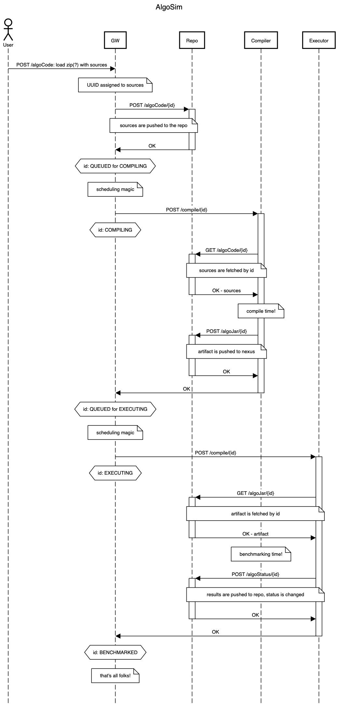

***
TODO:
- maybe services host and basepath as .properties file
- how to use swagger-ui in terms of containers and envoy?
***
Структура репо:
- Dockerfile-base, Dockerfile-dist-{jdk,jre}, start-service.sh - для сборки базовых образов. В base (он с jdk,maven, исходным кодом клиентов) собирается артефакт сервиса, в dist (тонкий образ, alpine+envoy+(jre|jdk)) он запускается.
- docker-compose.yml
- configs/:
  - algosim-sequnce.{png,txt} - последовательность взаимодействия сервисов 
  - envoy-configs/ - конфигурационные файлы маршрутизации
  - openapi-specs/ - openapi спецификации всех сервисов
  - generator-configs/ - конфиги для генерации заглушек серверов/клиентов сервисов. По факту всё уже сгенерировано и лежит в соответствующих папках
- {gateway,repo,compiler,executor}/ - сгенерированные сервисы:
  - server/ - непосредственно серверная часть, запускается и сервит данные
  - client/ - сгенерированные клиенты чтобы обращаться к серверам в java-программа по человечески. Пример смотри в `gateway/server/src/main/java/hse/algosim/gateway/server/api/AlgoCodeApiController.java`. Там мы получаем и принимаем из сервиса repo файлы и данные.
***
Порядок действий (из корня проекта):
1. Сначала собрать algosim-base (там все клиенты), algosim-dist-{jre,jdk} (envoy+jre для финальных контейнеров). Почему-то не кэшируетсяв мультистейдже, приходится отдельно, потом разберусь. 
  - `docker build -t algosim-base -f Dockerfile-base .`
  - `docker build -t algosim-dist-jre -f Dockerfile-dist-jre .`
  - `docker build -t algosim-dist-jdk -f Dockerfile-dist-jdk .`
2. Потом уже собрать  и запустить сервисы по `docker-compose up --build`. Для того чтобы запустить сборку без использования закэшированных слоев (если вам кажется, что что-то не подхватывается при сборке) - `docker-compose build --no-cache`.
3. Несолько compiler-worker'ов - `docker-compose up --scale compiler=3`
