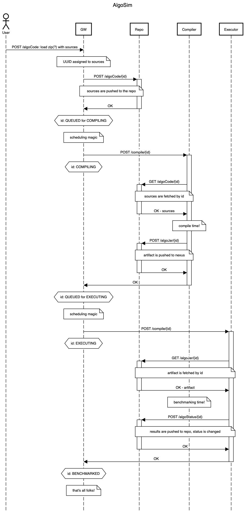

***
TODO:
- как разобраться с зависимостями?
- repoUrl как передавать в образ для docker-multiworker
- улучшить сообщения об ошибках
- перейти на единый формат сериализации (gson/jackson) в клиентах и серверах, сделать единый артефакт с моделями
- profit&loss по всем валютам с приведением к базовой по курсу закрытия дня
- ордера - постгрес
- Учёт спреда 
- Принудительное закрытие ордеров по текущей цене
- Компиляции/исполнение алгоритма c коллбэками и закрытиям по таймауту
- Индикаторы
- пояснить что пока что без кредитных плечей итд
Optional TODO:
- поправить swagger-ui чтоьы выстраивались корректные запросы с учетом envoy-прокси
- swagger-ui отображает query вместо formData
- BUG: запросы работают либо без Accept, либо с "Accept: application/json, application/octet-stream"; c "Accept: application/octet-stream, application/json" НЕ работают, разобраться почему
***
Структура репо:
- docker-compose.yml
- algosim-sequnce.{png,txt} - последовательность взаимодействия сервисов 
- framework/ - непосредственно код логики трейдинга
- clients/ - сгенерированные  и допиленные клиенты ко всем серверам
- {gateway,repo,compiler,executor}/ - сервера-компоненты платформы
- models/ - модели и переиспользуемые классы всех серверов
- quotes/ - тестовый набор данных 
***
Запуск платформы в контейнерах:
1. `mvn clean package -P docker`
2. `docker-compose up`
  + Обращение к компонентам только через захардкоженно переданный как параметр хост и порт.
  + `curl -X POST "http://localhost:8080/api/algoCode" -H "accept: application/json" -H "Content-Type: multipart/form-data" -F "code=@framework/src/main/java/TradingAlgorithmImpl.java" -F "userId=kirko" -F "userAlgoName=right" -u "user:password"`
  + `curl "http://localhost:8080/api/getTop" -u "user:password" | jq`
3. `docker-compose down -v`
***
Несолько compiler- и executor- worker'ов:
1. `mvn clean package -P docker`
2. `docker-compose -f docker-compose-multiworker.yml up --scale compiler=2 --scale executor=2`. 
  + В таком случае на хостнеймах компонент платформы должен стоять loab-balancer. В docker-compose его роль исполняет образ envoy. Envoy обчеспечивает роутинг на все компоненты через соответствующий префикс.
  + `curl -X POST "http://localhost:8000/api/algoCode" -H "accept: application/json" -H "Content-Type: multipart/form-data" -F "code=@framework/src/main/java/TradingAlgorithmImpl.java" -F "userId=kirko" -F "userAlgoName=right" -u "user:password"`
  + `curl "http://localhost:8000/api/getTop" -u "user:password" | jq`
  + `curl "http://localhost:8000/repo/api/algoStatus/b03b6c6d-a945-4986-970a-43a0c899ab09" -u "user:password"`
4. `docker-compose -f docker-compose-multiworker.yml down -v`
***
Запуск jar-артефактов:
1. `mvn clean package -P boot` 
2. 
   + `java -Xverify:none -jar repo/target/repo-server-1.1.0-SNAPSHOT.jar --server.port=8081`
   + `java -Xverify:none -DpathToFramework=./framework -DrepoUrl=http://127.0.0.1:8081/api -jar compiler/target/compiler-server-1.1.0-SNAPSHOT.jar --server.port=8082`
   + `java -Xverify:none -DpathToQuotes=./quotes -DrepoUrl=http://127.0.0.1:8081/api -jar executor/target/executor-server-1.1.0-SNAPSHOT.jar --server.port=8083`
   + `java -Xverify:none -DrepoUrl=http://127.0.0.1:8081/api -DcompilerUrl=http://127.0.0.1:8082/api -DexecutorUrl=http://127.0.0.1:8083/api -jar gateway/target/gateway-server-1.1.0-SNAPSHOT.jar --server.port=8080`
***
Аргументы артефактов (параметры):

Oбщие:
+ `--server.port=8080`
+ `--server.address=0.0.0.0`
+ `-DrepoUrl=http://repo:8080/api`

В compiler'e:
+ `-DpathToFramework=/framework`

В executor'e:
+ `-DpathToQuotes=/quotes`

В gateway'e:
+ `-DcompilerUrl=http://compiler:8080/api`
+ `-DexecutorUrl=http://executor:8080/api`
